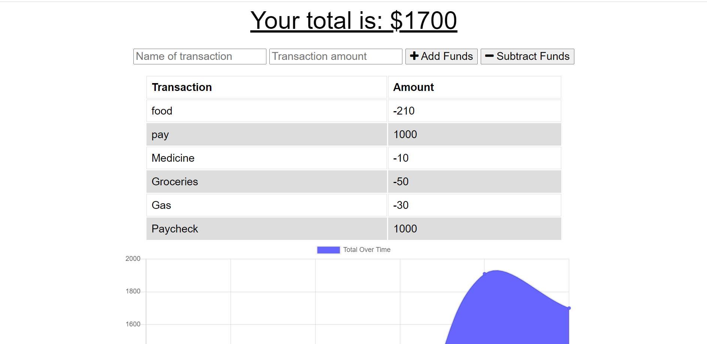
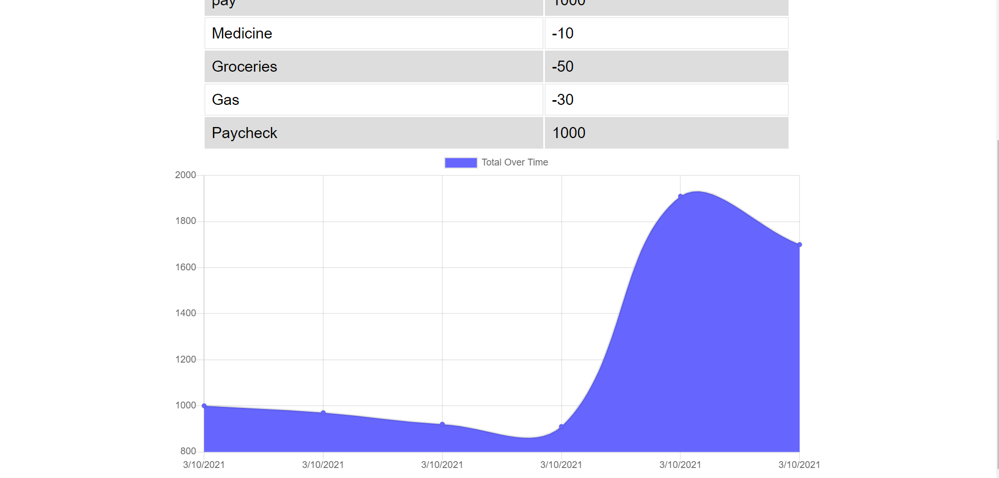

# budget-tracker

## Description

Budget Tracker is a progressive web application used to keep track of additions and deductions to one's budget. The application starts with a zero balance and, as you add items and designate them as addition or substraction, the balance is updated. You can add the name of the transaction and the dollar amount. A table is created as you add more items to the list as well as a chart to display the fluctuation of the balance. The application is progressive so you can still use it even if you don't have internet access. The application will queue any items you add while offline and, as soon as you have an internet connection, it'll add the queued items to the database to make sure you can keep all your information. Below is a screenshot of the application primarily showing the balance and the table.

And below is another screenshot primarily showing the graph.

## Table of Contents

* [Installation](#installation)
* [Usage](#usage)
* [License](#license)
* [Contributing](#contributing)
* [Tests](#tests)
* [Questions](#questions)

## Installation

There's no need to install this application to see it run. Simply navigate to the link below to see it in action.

https://guarded-reaches-27987.herokuapp.com/

## Usage

The application can be used to keep track of your budget even when you don't have internet access. The application automatically takes care of savings your data to the database as soon as you connect to the internet.

## Tests

There is no testing available within the application.

## Questions

My GitHub username is: chavalk

Link: https://github.com/chavalk

If you have additional questions, feel free to reach me at chavalk@hotmail.com.